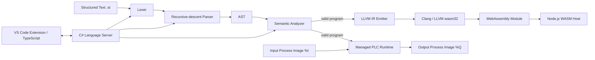

# PLCFlow Architecture

PLCFlow separates language processing, editor tooling and execution backends so that each layer can evolve independently.

## Compiler frontend

`PLCFlow.Compiler` owns tokenization, parsing, AST construction and semantic/type validation. The frontend is shared by the CLI and Language Server.

## Managed PLC runtime

`PLCFlow.Runtime` models the PLC scan cycle:

1. Copy physical/host inputs into the input process image.
2. Execute the compiled AST deterministically.
3. Update function-block state such as `TON`.
4. Copy program outputs into the output process image.

Runtime memory persists across scan cycles, matching the stateful execution model expected in PLC software.

## LLVM / WebAssembly backend

`LlvmEmitter` lowers the supported AST to inspectable LLVM IR using a `wasm32-unknown-unknown` target triple. `WasmToolchain` invokes Clang/LLVM to create a `.wasm` module. The module exposes a small PLC ABI:

- `plc_set_<Input>()`
- `plc_get_<Output>()`
- `plc_set_cycle_ms()`
- `plc_get_<Timer>_Q()` / `ET()` / `PT()`
- `scan_cycle()`

The ABI avoids coupling the host to raw WebAssembly linear-memory offsets.

## Language Server

`PLCFlow.LanguageServer` is a standalone .NET process. The TypeScript VS Code extension communicates with it through the Language Server Protocol and provides:

- compiler-backed diagnostics
- symbol hover
- go-to-definition
- context-aware completion for `TON` members

## Engineering boundary

PLCFlow deliberately implements a focused IEC 61131-3-inspired subset. It is not a certified PLC runtime, safety controller or complete IEC 61131-3 implementation.
